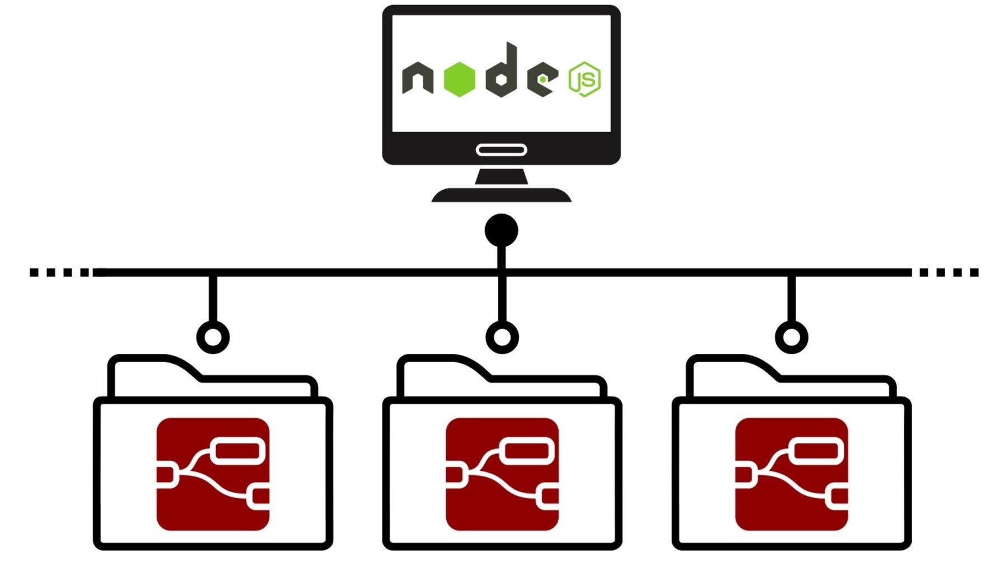

# Hive-RED
Simple Node-RED setup environment

## Concept

When you install Node-RED globally, it is installed on your system.  
Hive-RED installs Node-RED for each project.  
Each folder where you download Hive-RED has a different Node-RED environment.  

## How to use

Now, this repository supports **Windows only**.  
Node.js must be installed in advance.  

Node.js: <https://nodejs.org/en/download>

Use npm command to install.

`npm install <folder path>`
